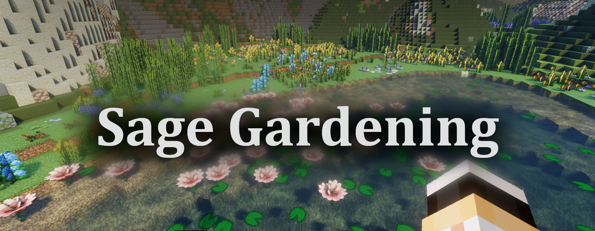
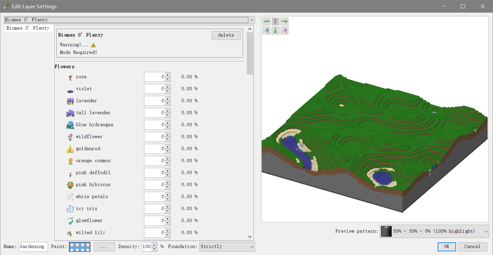
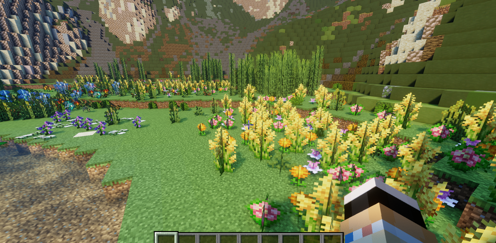
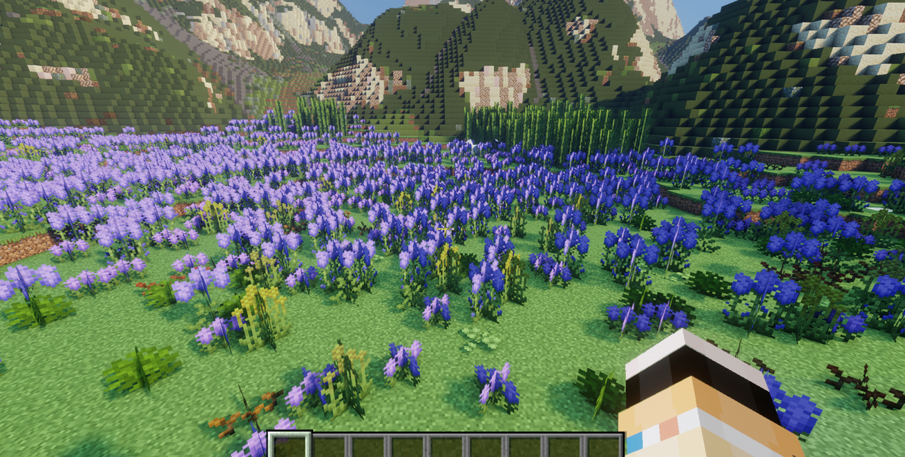
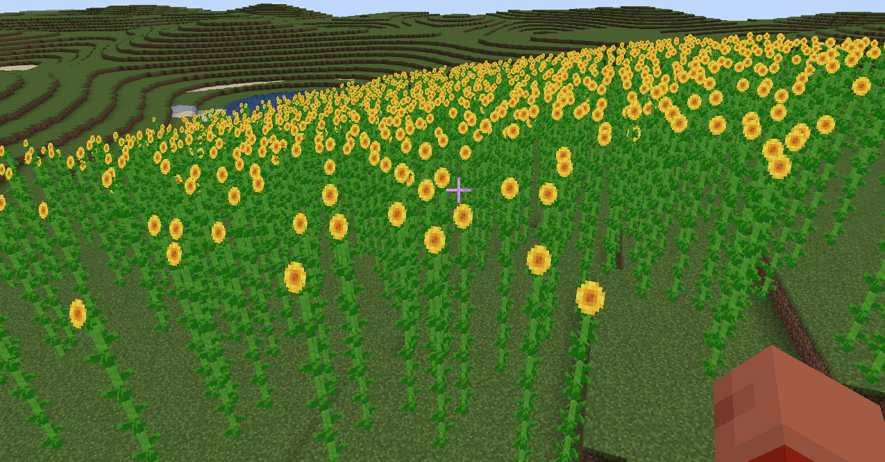

# WorldPainter Plugin - Sage Gardening



[**Sage Gardening**](https://github.com/ALingll/worldpainter-plugin-sage-gardening) is a plugin for **WorldPainter** that introduces a new custom layer: the **Custom Gardening Layer**, which behaves similarly to the _Custom Plant Layer_.  
However, unlike the _Custom Plant Layer_, the key differences are:  
👉 The **Custom Gardening Layer** does not define plant structures through hard-coded logic. Instead, it uses **external JSON files** to describe them with **Patterns**.  
👉 **Sage Gardening** already comes with built-in support for most plants from _VerdantVibes_ and _Biomes O’ Plenty_, which can be easily accessed from the menu.

This means you can easily:
- Define structures for vanilla or modded plants;
- Extend new plants without changing the plugin’s code;
- Share and reuse JSON Pattern files, making plant configurations more intuitive and maintainable.


## 🌱 What is a Pattern?

A **Pattern** is the “blueprint” of vegetation. It describes what blocks a plant consists of and how those blocks are arranged, ordered, and combined.
- **Composition**: Defines which blocks (e.g., trunk, leaves, flowers, vines) are used;
- **Order**: Specifies the placement sequence (e.g., trunk first, then flowers);
- **Arrangement**: Determines how blocks are placed, such as upright stems, layered leaves, spherical canopies, or branching/symmetrical structures;
- **Transformations**: Supports rotations, height variations, and other variants, allowing a single Pattern to generate diverse plant appearances.

## 🔧 How to Use

1. **Prepare Patterns**  
    Place your JSON Pattern files in the plugin’s configuration directory. Some built-in Patterns are already included and will appear automatically in the dropdown list.  
    User-provided JSON files should be placed under:  
    `plugin_data\gardening_layer` inside the WorldPainter configuration directory.  
    For example, on Windows:  
    `C:\Users\{UserName}\AppData\Roaming\WorldPainter\plugin_data\gardening_layer\{YourJson}.json`
2. **Select a Pattern**  
    Add the **Sage Gardening Layer** in WorldPainter, then choose your desired Pattern from the dropdown menu.
3. **Paint & Export**  
    Configure and paint the layer just like the native Custom Plant Layer. When exporting, the plugin generates vegetation according to the Pattern’s description.  
    Note: Modded plants will appear as magenta wool in the preview.
4. **Define Your Own Patterns**  
    See the [reference here](https://github.com/ALingll/worldpainter-plugin-sage-gardening/wiki/Plant-Pattern-Reference).



## ✨ Feature Highlights

- **Decoupled structure**: Plant blueprints are stored in JSON configs instead of hard-coded logic, making them more flexible.
- **Mod support**: Directly reference modded blocks in Patterns without editing code.
- **Reusable & shareable**: Pattern files can be bundled into “plant libraries” for teams or community sharing.
- **Environment validation strategies**: Choose how to handle foundation blocks (ignore / check / replace) and configure growth environments (terrestrial / submerged / floating) to ensure plants generate correctly.

## 🚨 Warnings

- The plugin is still under active development. If you encounter bugs, please report them via GitHub.
- Always back up your `.world` files before using this plugin to avoid potential data loss.

## ⚙ Configuration

By default, the icons shown in the Gardening Layer Editor’s GUI will **not** be displayed (this does not affect functionality).  
To enable these icons, you need to have the corresponding mod’s `.jar` file on your computer and complete the following steps:
1. Open or create the `settings.json` file inside the plugin configuration directory (the same directory where Pattern files are stored).  
    For example, on Windows it is typically located at:  
    `C:\Users\{UserName}\AppData\Roaming\WorldPainter\plugin_data\gardening_layer\settings.json`
2. Paste the following content into the file:
```json
{
    "resources":{
        "verdantvibes":"D:\\path\\to\\you\\mod.jar",
        "biomesoplenty":"D:\\path\\to\\you\\mod.jar"
    }
}
```
1. Replace the above paths with the actual paths to the mod files on your PC.

## 🖼 Gallery






## ChangeLog
- Add a snapshot configuration to 1.21.5 plants.

## TODO
- The current configuration structure writing is too complex and may be simplified in the future.
- Aquatic plants are not currently supported, but may be in the future.
- There is currently no documentation on how to write configuration JSON structures. However, a built-in configuration is provided for [reference](src/main/resources/org/cti/wpplugin/gardening/internal/Verdantvibes.json), which supports the new vegetation added by the [VerdantVibes](https://github.com/Pandarix/VerdantVibes) mod.


---
© 2025 CTI-ALingll. All rights reserved.
